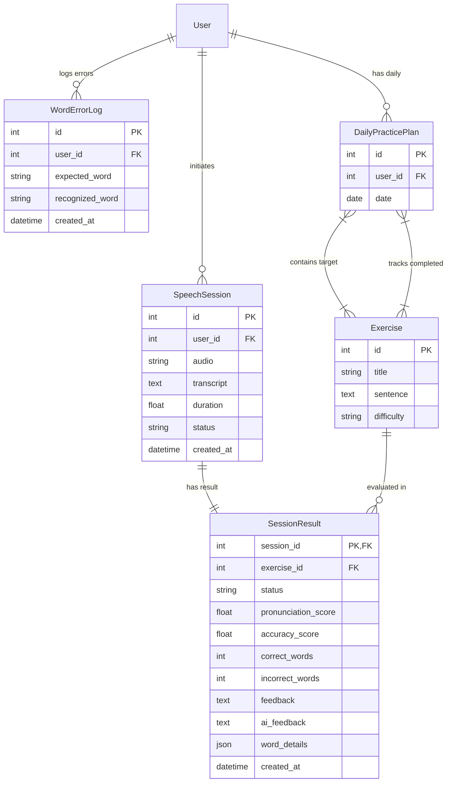

# Mozhi (മൊഴി) - AI-Powered Malayalam Speech Therapy & Reading Fluency Platform

**Mozhi** (മൊഴി - *Articulate Care*) is a production-grade, AI-driven speech therapy and Malayalam reading fluency assessment platform. Built on **Django REST Framework (DRF)** and **OpenAI's Whisper ASR engine**, Mozhi provides an automated pipeline for analyzing spoken Malayalam articulation, calculating word-level reading accuracy, logging phonetic error patterns, delivering localized Malayalam clinical feedback, and generating dynamic, adaptive daily practice plans tailored to individual patient learning needs.

---

## Visual Showcase & Application Screenshots

The application features a responsive user interface built to consume the backend APIs. Below are verified screenshots corresponding to active, working application flows:

| **Authentication & User Onboarding** | **Daily Practice Plan Dashboard** |
| :---: | :---: |
|  |  |
| *JWT-backed secure login and user registration interface (`/api/login/`, `/api/register/`).* | *Personalized practice plan generated dynamically based on weak word analytics (`/api/plan/today/`).* |

| **Speech Assessment & Real-time Feedback** | **Practice History & Performance Tracking** |
| :---: | :---: |
|  |  |
| *Pronunciation evaluation with word-level accuracy chips and Malayalam feedback (`/api/pronunciation/`, `/api/results/:id/`).* | *Historical practice sessions with detailed per-word accuracy drilldowns (`/api/results/`).* |

---

## Core Features

- 🎙️ **Malayalam Speech Recognition (ASR)**
  Powered by OpenAI's Whisper model (`small` model explicitly targeted at Malayalam `language="ml"`) to transcribe spoken Malayalam audio.

- 🎛️ **Audio Normalization via FFmpeg**
  `FFmpegService.to_wav_16k_mono` converts multi-format client audio uploads (`.webm`, `.m4a`, etc.) into 16kHz 1-channel PCM WAV audio required by Whisper.

- ⚡ **Asynchronous Background Processing**
  Background worker threads (`threading.Thread`) execute FFmpeg conversion, ASR transcription, and sequence alignment asynchronously, returning an immediate `201 Created` task ID for client polling.

- 🔍 **Word-Level Reading Fluency & Pronunciation Alignment**
  `PronunciationService.compare` strips Malayalam punctuation via regex (`re.sub`) and aligns spoken words against exercise target sentences using Python's `difflib.SequenceMatcher`.

- 📊 **Word Error Logging & Analytics**
  Mispronounced target words are logged into `WordErrorLog` records to track persistent user phonetic challenges over time.

- 🎯 **Adaptive Recommendation Engine**
  `RecommendationService.recommend_exercises` queries recent error logs, calculates top weak words via `collections.Counter`, and prioritizes exercises matching those words.

- 📅 **Automated Daily Practice Plan Generation**
  `PlanService.get_or_create_today_plan` dynamically creates date-bound `DailyPracticePlan` instances populated with personalized exercises.

- 💬 **Localized Malayalam Clinical Feedback**
  `FeedbackService.generate` evaluates accuracy scores against clinical performance tiers and returns localized feedback written in Malayalam script.

- 🔐 **Stateless JWT Authentication**
  User authentication powered by `rest_framework_simplejwt` with 60-minute access tokens and 7-day refresh tokens.

---

## Tech Stack

### Backend Stack (Primary Focus)
* **Framework:** Python 3.10+, Django 5.2, Django REST Framework (DRF 3.16+)
* **Authentication:** `rest_framework_simplejwt` (JSON Web Tokens)
* **ASR / Speech Engine:** OpenAI Whisper (`whisper` library, `small` model)
* **Audio Engineering:** FFmpeg (`subprocess` CLI execution for 16kHz mono WAV conversion)
* **Database:** SQLite3 (Django ORM - production-ready for PostgreSQL / MySQL migration)
* **Text Analysis:** Python `difflib` (SequenceMatcher), Regular Expressions (`re`)
* **CORS Middleware:** `django-cors-headers`

### Frontend Application (Brief Overview)
* **Framework:** React 19 with TypeScript, Vite, TanStack Router & Query, TailwindCSS, Radix UI. *Operates as a decoupled Single Page Application (SPA) consuming backend REST APIs.*

---

## Project Directory Structure

```
speech_Therapy/
├── speechTherapy/                 # Django Project Root
│   ├── accounts/                  # Authentication App
│   │   ├── models.py              # Extends Django default User
│   │   ├── serializers.py         # RegisterSerializer with password hashing
│   │   ├── views.py               # RegisterView (CreateAPIView)
│   │   └── urls.py                # Routes: /register/, /login/, /token/refresh/
│   │
│   ├── speech/                    # Core Speech Processing & Fluency App
│   │   ├── models.py              # Models: SpeechSession, Exercise, SessionResult, WordErrorLog, DailyPracticePlan
│   │   ├── serializers.py         # Serializers: SpeechSessionSerializer, ExerciseSerializer, SessionResultSerializer, DailyPracticePlanSerializer
│   │   ├── views.py               # Controllers: UploadSpeechView, PronunciationSubmitView, ExerciseListView, TodayPlanView, etc.
│   │   ├── urls.py                # API Endpoints routing
│   │   └── services/              # Verified Service Layer Architecture
│   │       ├── ffmpeg_service.py        # FFmpeg audio conversion to 16kHz mono WAV
│   │       ├── whisper_service.py       # OpenAI Whisper ASR Malayalam transcription
│   │       ├── pronunciation_service.py # Text normalization & difflib word comparison
│   │       ├── scoring_service.py       # Accuracy score percentage calculation
│   │       ├── feedback_service.py      # Malayalam feedback text generator
│   │       ├── recommendation_service.py# Weak word analysis & exercise selection
│   │       └── plan_service.py          # Daily practice plan lifecycle manager
│   │
│   ├── media/                     # Audio File Storage
│   │   └── audio/                 # Uploaded (.webm) & processed (_16k.wav) files
│   │
│   ├── manage.py                  # Django Management CLI
│   └── settings.py                # Django Settings (JWT, CORS, Media, Installed Apps)
│
├── Frontend/                      # Decoupled React SPA Frontend
├── output/                        # Visual screenshots and execution outputs
├── requirements.txt               # Backend Python dependencies
└── README.md                      # Production project documentation
```

---

## Backend Runtime Architecture

The backend implements a **Clean Service Layer Architecture** pattern within Django REST Framework, separating HTTP controllers from speech processing, audio conversion, sequence alignment algorithms, and adaptive recommendation logic.

### Runtime Request Execution Flow

```
Client (React SPA)
       │
       │  [HTTP Request with JWT Authorization Header]
       ▼
Django URL Router (`speechTherapy.urls` -> `accounts.urls` / `speech.urls`)
       │
       ▼
REST Controller View (`views.py`)
       │
       ├─► Validation & Object Creation (`serializers.py` & `models.py`)
       │
       ▼
Asynchronous Background Thread (`threading.Thread`)
       │
       ├─► 1. FFmpeg Service (`FFmpegService.to_wav_16k_mono`)
       │      └── Converts audio upload to 16kHz mono WAV PCM format
       │
       ├─► 2. Whisper ASR Engine (`WhisperService.transcribe`)
       │      └── Transcribes Malayalam audio (`language="ml"`)
       │
       ├─► 3. Pronunciation Service (`PronunciationService.compare`)
       │      └── Normalizes text & computes word differences via difflib
       │
       ├─► 4. Scoring Service (`ScoringService.calculate`)
       │      └── Computes percentage accuracy: (correct / total) * 100
       │
       ├─► 5. Feedback Service (`FeedbackService.generate`)
       │      └── Maps score to localized Malayalam therapist feedback
       │
       ├─► 6. Error Analytics (`WordErrorLog`)
       │      └── Persists mispronounced target words for recommendation analysis
       │
       ▼
Result Database Record Updated (`SessionResult` status="done")
       │
       │  [Client Polls GET /api/results/:id/]
       ▼
Client Receives Complete Result JSON
```

---

## Runtime Architecture Flowchart

```mermaid
flowchart TD

    subgraph Client Layer
        A[Client Browser / React SPA]
    end

    subgraph API Routing & Controllers
        B[Django URL Router]
        C[PronunciationSubmitView Controller]
        D[SpeechSession & SessionResult Serializers]
    end

    subgraph Verified Service Architecture
        E[FFmpegService]
        F[WhisperService]
        G[PronunciationService]
        H[ScoringService]
        I[FeedbackService]
        J[RecommendationService]
    end

    subgraph Database Layer
        K[(SQLite / Database)]
    end

    %% Execution Path
    A -->|1. POST /api/pronunciation/ audio + exercise_id| B
    B --> C
    C --> D
    D -->|2. Create Session & Pending Result| K
    C -->|3. Return HTTP 201 { id: result_id } Immediately| A
    
    C -.->|4. Spawn Async Processing Thread| E
    E -->|Convert to 16kHz mono WAV| F
    F -->|Transcribe Malayalam Speech| G
    G -->|Compare Text with Expected Sentence| H
    H -->|Calculate Accuracy %| I
    I -->|Generate Malayalam Feedback| K
    G -->|Log Incorrect Words to WordErrorLog| K

    A -->|5. Poll GET /api/results/:id/| B
    K -->|6. Return Completed SessionResult JSON| A
    
    A -->|7. Request GET /api/plan/today/| B
    B --> J
    J -->|Query Weak Words & Recommend| K
```

---

## Database Schema & Data Models

The system relies on 5 active data models inside `speech/models.py` along with Django's standard `User` model:



### Model Specifications

1. **`SpeechSession`**: Manages uploaded audio files, processing status (`pending`, `done`, `failed`), recognized transcript text, and duration.
2. **`Exercise`**: Stores target Malayalam practice sentences and difficulty levels (`easy`, `medium`, `hard`).
3. **`SessionResult`**: One-to-One extension of `SpeechSession` using primary key inheritance (`session_id`). Stores numerical accuracy scores, correct/incorrect word counts, raw JSON list of per-word correctness, and Malayalam feedback.
4. **`WordErrorLog`**: Records individual mispronounced words per user for weak-word analysis.
5. **`DailyPracticePlan`**: Represents a user's daily assignment, linking target exercises and tracking completed exercises per date.

---

## Verified API Endpoints Reference

All endpoints are registered in `accounts/urls.py` and `speech/urls.py` and routed under `/api/`:

### 1. Authentication Endpoints (`accounts/urls.py`)

| Method | Endpoint | View Controller | Auth Required |
| :--- | :--- | :--- | :---: |
| `POST` | `/api/register/` | `RegisterView` | No |
| `POST` | `/api/login/` | `TokenObtainPairView` | No |
| `POST` | `/api/token/refresh/` | `TokenRefreshView` | No |

### 2. Speech & Audio Upload (`speech/urls.py`)

| Method | Endpoint | View Controller | Auth Required |
| :--- | :--- | :--- | :---: |
| `POST` | `/api/upload/` | `UploadSpeechView` | Yes |
| `GET` | `/api/history/` | `SpeechHistoryView` | Yes |
| `GET` | `/api/history/:id/` | `SpeechDetailView` | Yes |

### 3. Exercises & Practice (`speech/urls.py`)

| Method | Endpoint | View Controller | Auth Required |
| :--- | :--- | :--- | :---: |
| `GET` | `/api/exercises/` | `ExerciseListView` | Yes |
| `GET` | `/api/exercises/:id/` | `ExerciseDetailView` | Yes |
| `GET` | `/api/recommendations/` | `RecommendedExercisesView` | Yes |

### 4. Pronunciation Evaluation & Results (`speech/urls.py`)

| Method | Endpoint | View Controller | Auth Required |
| :--- | :--- | :--- | :---: |
| `POST` | `/api/pronunciation/` | `PronunciationSubmitView` | Yes |
| `GET` | `/api/results/` | `ResultListView` | Yes |
| `GET` | `/api/results/:id/` | `ResultDetailView` | Yes |

### 5. Daily Practice Plan (`speech/urls.py`)

| Method | Endpoint | View Controller | Auth Required |
| :--- | :--- | :--- | :---: |
| `GET` | `/api/plan/today/` | `TodayPlanView` | Yes |

---

## Speech Processing & Pronunciation Pipeline Details

### 1. Audio Normalization (`FFmpegService`)
Audio uploaded from browser recorders is converted to a standardized WAV format required by Whisper:
```python
command = ["ffmpeg", "-y", "-i", input_path, "-ar", "16000", "-ac", "1", output_path]
```
This forces a **16,000 Hz sample rate** and **1 channel (mono)** format.

### 2. Malayalam ASR Transcription (`WhisperService`)
Whisper model execution is managed as a lazy singleton:
```python
_model = whisper.load_model("small")
result = _model.transcribe(audio_path, language="ml")
```
Targeting `language="ml"` ensures transcription into Malayalam script.

### 3. Sentence Alignment & Word Fluency (`PronunciationService`)
Punctuation (`। . , ! ? ; : " ' ( )`) is removed via regex `re.sub(r"[।.,!?;:\"'()]", "", w)`.

Punctuation-normalized expected and recognized word lists are aligned via `difflib.SequenceMatcher`:
```python
matcher = difflib.SequenceMatcher(None, expected_words, recognized_words)
for tag, i1, i2, j1, j2 in matcher.get_opcodes():
    if tag == "equal":
        for w in expected_words[i1:i2]:
            word_details.append({"word": w, "correct": True})
    else:
        for w in expected_words[i1:i2]:
            word_details.append({"word": w, "correct": False})
```

### 4. Accuracy Scoring & Clinical Feedback (`ScoringService` & `FeedbackService`)
- **Accuracy Ratio Calculation**:
  $$\text{Accuracy} = \left( \frac{\text{Correct Words}}{\text{Total Expected Words}} \right) \times 100$$
- **Clinical Malayalam Feedback Mapping**:
  - **Score > 90%**: `"മികച്ചത്! ഉച്ചാരണം വളരെ നല്ലതാണ്."` *(Excellent! Pronunciation is very good.)*
  - **Score 80% - 90%**: `"വളരെ നല്ലത്. കുറച്ചുകൂടി പരിശീലിക്കുക."` *(Very good. Practice a bit more.)*
  - **Score 60% - 79%**: `"മെച്ചപ്പെടുത്തേണ്ടതുണ്ട്. വീണ്ടും ശ്രമിക്കുക."` *(Needs improvement. Try again.)*
  - **Score < 60%**: `"ദയവായി വ്യായാമം ആവർത്തിക്കുക."` *(Please repeat the exercise.)*

---

## Setup & Execution Guide

### Prerequisites
- **Python 3.10+**
- **FFmpeg** installed and accessible in System PATH
- **Node.js 18+** & **npm** (if running the frontend application)

### 1. Backend Installation

Navigate to the backend folder:
```bash
cd speechTherapy
```

Create and activate a virtual environment:
```bash
# Windows
python -m venv myenv
myenv\Scripts\activate

# Linux / macOS
python3 -m venv myenv
source myenv/bin/activate
```

Install backend dependencies:
```bash
pip install -r ../requirements.txt
```

### 2. Database Migration

Initialize database tables:
```bash
python manage.py makemigrations
python manage.py migrate
```

### 3. Run the Backend Application Server

Start the Django REST server:
```bash
python manage.py runserver 8000
```
The REST API will be accessible at `http://127.0.0.1:8000/api/`.

---

## Brief Frontend Overview

The frontend located in `Frontend/` is a React SPA built with Vite and TailwindCSS that communicates with the Django REST API endpoints.

To run the frontend:
```bash
cd Frontend
npm install
npm run dev
```
The application interface runs at `http://localhost:8080`.
